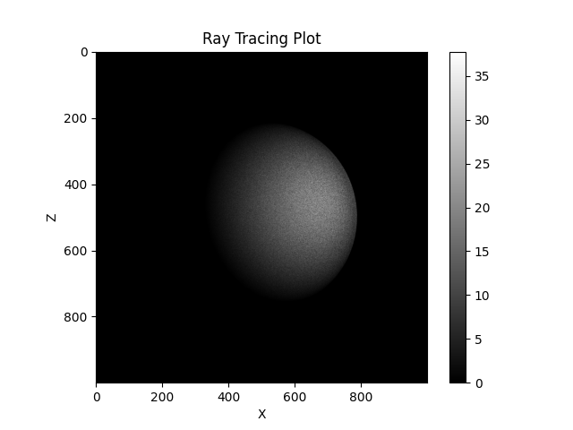
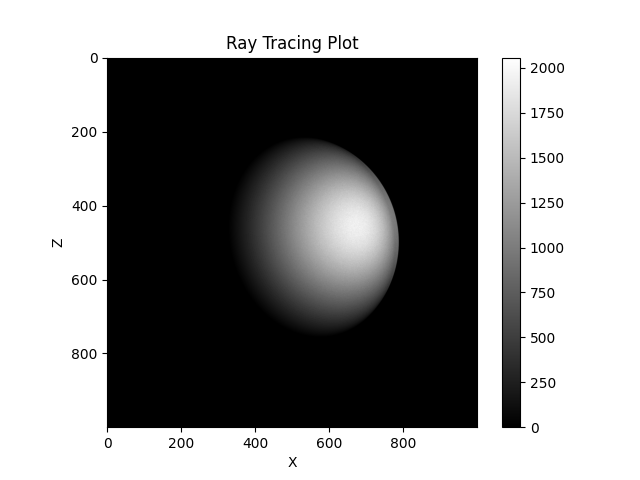

# Project 3 - Ray Tracing

## Local System Information (CPU Testing):
### Processor:

```
Chip:               Apple M1 Pro
Number of Cores:	8 (6 performance and 2 efficiency)
```

### Compiler:

```
Compiler:           GNU C++ compiler - g++
Version:            11
```

## Midway3 System Information (GPU Testing):

### GPU:

```
GPU version: Nvidia V100
```

# Milestone 1 - Serial CPU Implementation

The purpose of this portion of the project is to develop a serial, cpu-based algorithm for ray tracing. 

## Run Instructions:
To run the ray tracing algorithm written in C++, follow these steps.

1. Enter the correct directory - 
```
cd milestone-1
```

2. Specify the input **N_rays** and **N_gridpoints** in the Makefile.

3. Build and run - 
```
make
```

This will generate the executable, run the code for the inputs specified in the Makefile, and generate the plot for the render.

The outputs can be found in the **milestone-1/output** directory.

## Results:

### Inputs - 
```
1. N_rays = 1e7
2. N_gridpoints = 1000
```

### Output - 



# Milestone 1 - Parallel GPU Implementation

The purpose of this portion of the project is to develop a parallel, gpu-based algorithm for ray tracing. 

## Parallelization Strategy:

I am implementing the parallel algorithm by computing a **single ray per GPU thread**.

## Run Instructions:
To run the ray tracing algorithm written in C++ with the GPU programming done with CUDA on an Nvidia GPU, follow these steps.

1. Enter the correct directory - 
```
cd final-version
```

2. If you have a GPU on your system, then specify the input **N_rays**, **N_gridpoints** and **n_threads_per_block** in the Makefile.

If not, then specify the same inputs in the same order listed above in the batch_file.

3. If you have a GPU on your system, the build and run with the following command - 

```
make
```

This will generate the executable, run the code for the inputs specified in the Makefile, and generate the plot for the render.

If you do not have a GPU, then this can be run on Midway3 by submitting the batch_file as a job. To visualize this, copy then output file by modifying the username and filepaths in copy_output.sh and then running the following - 

```
./copy_output.sh
```

followed by - 

```
./visualize.sh
```

The outputs can be found in the **final-version/output** directory.

If there are any permission issues with running the shell scripts, run the following - 

```
chmod +x script_name.sh
```
## Analysis:

### Tests - 

Inputs - 
```
1. N_rays = 1e9
2. N_gridpoints = 1000
```

Note - 

The number of blocks is computed in the code and therefore, to find the optimal configuration the number of blocks and threads, I varied the number of threads which in turn will vary the number of blocks.


| Number of threads       | time (s)    |
| ----------- | ----------- |
| 64           | 44.4054     |
| 128           | 44.4152     |
| 256           | 44.4367     |
| 512           | 44.4146     |
| 1024           | 45.1344    |

### Optimal setting - 

```
n_threads_per_block = 64
```

### CPU vs GPU runtime comparison - 

Inputs - 
```
1. N_gridpoints = 1000
2. n_threads_per_block = 64
```

| Number of rays       | CPU runtime (s)      | GPU runtime (s)    |
| ----------- | ----------- |----------- |
| 1e3           | 0.043074     | 0.000563   |
| 1e4           | 0.427539     | 0.000950    |
| 1e5           | 4.2534     | 0.006631     |
| 1e6           | 41.949     | 0.058455    |
| 1e7           | 419.84     | 0.481965    |

## Results:

### Inputs - 
```
1. N_rays = 1e9
2. N_gridpoints = 1000
3. n_threads_per_block = 64
```

### Output - 

This is with a billion rays for a window size of 1000x1000.


