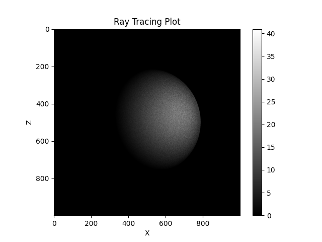

# Project 3 - Ray Tracing

## Local System Information:
### Processor:

```
Chip:               Apple M1 Pro
Number of Cores:	8 (6 performance and 2 efficiency)
```

### Compiler:

```
Compiler:           GNU C++ compiler - g++
Version:            11
```

# Milestone 1 - Serial CPU Implementation

The purpose of this portion of the project is to develop a serial, cpu-based algorithm for ray tracing. 

## Run Instructions:
To run the ray tracing algorithm written in C++, follow these steps.

1. Enter the correct directory - 
```
cd milestone-1
```

2. Specify the input **N_rays** and **N_gridpoints** in the Makefile.

3. Build and run - 
```
make
```

This will generate the executable, run the code for the inputs specified in the Makefile, and generate the plot for the render.

The outputs can be found in the **milestone-1/output** directory.

## Results:

### Inputs - 
```
1. N_rays = 1e7
2. N_gridpoints = 1000
```

### Output - 


